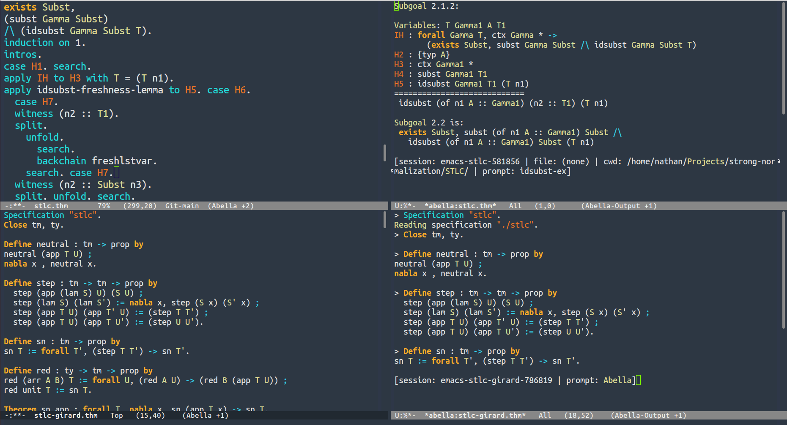

# Emacs Abella Mode
A major mode for the [Abella](abella-prover.org) proof assistant in Emacs.

# Features

## Commands

| Command | Effect |
|------|--------------------------------------|
| TAB | Automatically indent line or region |
| C-c RET | Evaluate abella state at cursor |
| C-c C-f | Step to next top-level command  |
| C-c C-b | Revert to previous top-level command |
| C-c C-n | Step to next tactic or command |
| C-c C-p | Revert to previous tactic or command |
| C-c C-c | Kill abella process (Must first escape with C-g) |

## Automatic Indentation
Definitions are indented automatically. 
Proof scripts are indented based on the depth of the proof state.

## Multiple Sessions
Each file spawns a different buffer running distinct sessions
through `abella_mcp`. Thus multiple sessions may be run independently.

# Screenshots


# Installation

You must first make sure that `abella` and  [`abella_mcp`](https://github.com/nguermond/abella-mcp) are installed in your `PATH` to enable interaction with abella. 
If this is not installed, syntax highlighting should still work, 
but interaction with abella will be disabled. 


To install, copy `abella.el` and `abella-mcp.el` (even if `abella_mcp` is not installed) somewhere in your `~/.emacs.d/*` directory, and add the following to your `init.el` file:
```elisp
(load (expand-file-name "<rel-path-to>/abella.el" user-emacs-directory))
(load (expand-file-name "<rel-path-to>/abella-mcp.el" user-emacs-directory))
```

# Contributing and Disclaimer
Contributions welcome, but please discuss potential changes or features in an issue before contributing. These files are to a large extent AI generated, use at your own risk.
